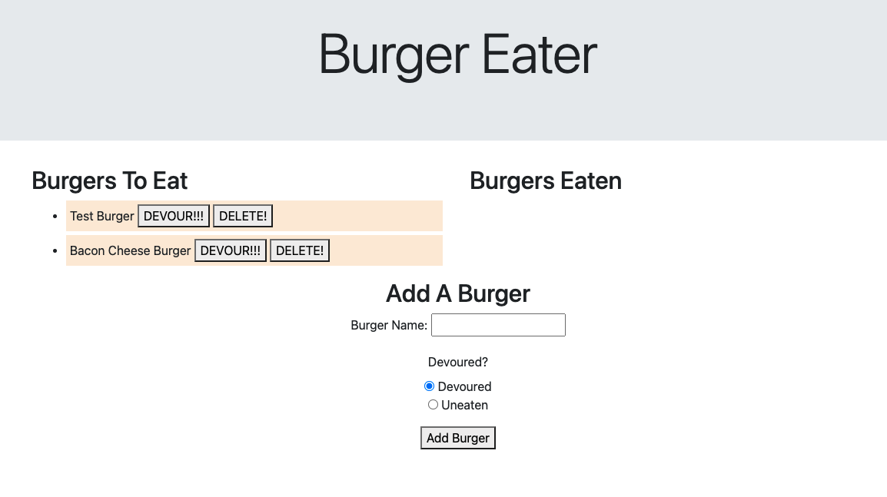

# Burger Eater Homework

[Deployed App](https://burger-mvc-app-homework.herokuapp.com/)

## Description

This burger eater app is a bootcamp homework focused on utilizing the MVC model with Heroku Deployment. The basic functionality is to add a burger which will be eaten. The back end uses MySQL and an ORM to manage the data and CRUD. All of the saved burgers are stored to MySQL as part of the Heroku deployment using JawsDB.

## Usage

Add a burger! Eat a burger!

## License

None

## Future Development

This project is something I want to rebuid from the ground up with a closer focus on front end appearance. I also want to build this out on a MERN stack using Mongoose and Atlas.
